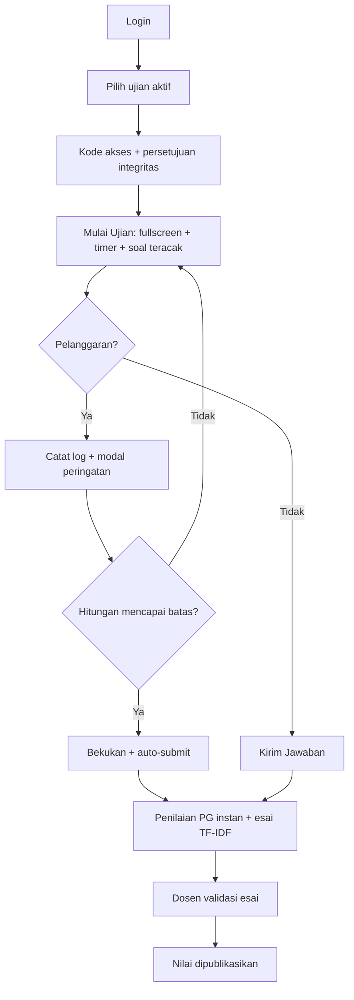
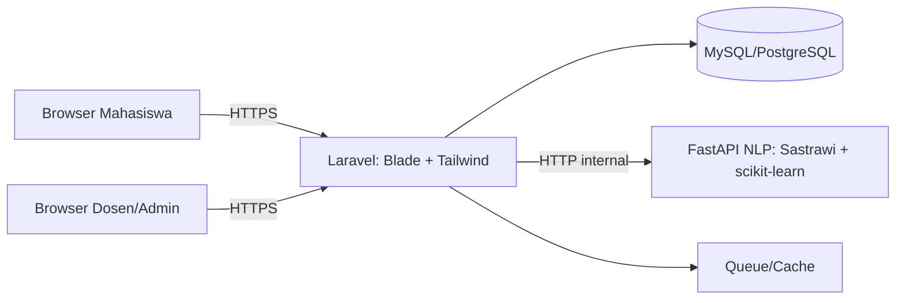
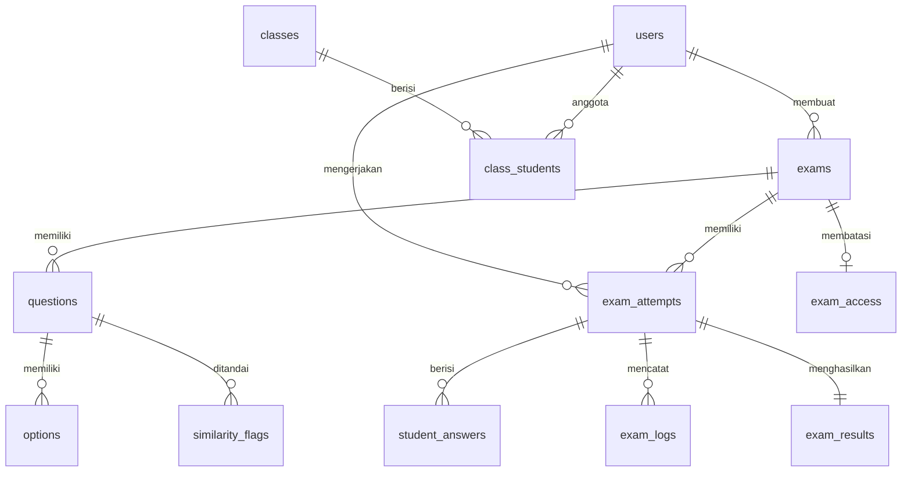

# PRD — ExamGuard CBT

**Product Requirements Document**
Sistem Computer Based Test (CBT) Berbasis Web dengan Mekanisme Anti-Tab Switching dan Penilaian Esai Otomatis Berbasis Cosine Similarity
Program Studi Pendidikan Informatika, Universitas Ivet

| Item | Isi |
|---|---|
| Versi | 1.0 (draf awal) |
| Status | Perencanaan |
| Stack | Laravel + Blade + Tailwind CSS, MySQL/PostgreSQL, microservice Python (FastAPI, Sastrawi, scikit-learn) |
| Dokumen terkait | [Task.md](Task.md), [StyleGuide.md](StyleGuide.md) |

---

## 1. Ringkasan

ExamGuard CBT adalah aplikasi web untuk ujian daring yang menjaga integritas akademik tanpa perangkat lunak tambahan di sisi mahasiswa. Sistem membatasi dan mencatat perilaku mencurigakan di browser (pindah tab, keluar layar penuh, salin-tempel), mengacak soal per mahasiswa, dan menilai soal esai secara otomatis dengan TF-IDF dan Cosine Similarity. Nilai esai berstatus **rekomendasi**; dosen yang memutuskan nilai akhir.

## 2. Latar Belakang dan Masalah

- Mahasiswa pada ujian daring rentan membuka tab baru, mencari jawaban lewat mesin pencari atau AI, dan bertukar jawaban.
- Dosen sering menghindari soal esai karena koreksi manual memakan waktu, sehingga umpan balik nilai lambat.

## 3. Tujuan

1. Membangun sistem ujian daring yang secara aktif membatasi dan mencatat kecurangan di browser (anti-tab switching, fullscreen enforcement, proteksi clipboard, pengacakan soal).
2. Mengimplementasikan Vector Space Model / Cosine Similarity untuk estimasi nilai esai berdasarkan kunci jawaban dan kata kunci dosen.
3. Menyediakan antarmuka validasi bagi dosen agar rekap nilai akhir lebih cepat dan objektif.

### Metrik Keberhasilan

| Metrik | Target |
|---|---|
| Latensi pencatatan pelanggaran | < 1 detik dari kejadian sampai tercatat di database |
| Akurasi esai | Korelasi Pearson sistem vs dosen yang dilaporkan, MAE dilaporkan (target awal r ≥ 0,7) |
| Skor SUS | ≥ 68 (di atas rata-rata) |
| Beban | 50–100 peserta bersamaan tanpa error |
| Kehilangan jawaban saat koneksi putus | 0 (kecuali jawaban < interval autosave terakhir) |

## 4. Ruang Lingkup

**Dalam lingkup:** ujian PG dan esai, anti-cheating sisi browser, pengacakan, penilaian otomatis, dashboard dosen, laporan nilai, manajemen akun.

**Di luar lingkup:** aplikasi desktop/mobile native, proctoring kamera/mikrofon, penilaian esai dengan LLM, dukungan perangkat mobile untuk mengerjakan ujian.

**Batasan jujur:** Web tidak dapat memblokir Alt+Tab atau shortcut OS. Sistem hanya **mendeteksi dan mencatat** lewat `visibilitychange`/`blur`. Proteksi sisi klien dapat dilewati oleh pengguna mahir, sehingga log dipakai sebagai penanda untuk ditinjau dosen, bukan bukti mutlak.

## 5. Peran Pengguna

| Peran | Kemampuan |
|---|---|
| **Admin** | Mengelola akun (daftar akun, peran, reset sesi), kelas, dan konfigurasi sistem. |
| **Dosen** | Membuat bank soal dan ujian, memantau ujian langsung, mengelola pelanggaran, memvalidasi nilai esai, mengunduh rekap. |
| **Mahasiswa** | Mengikuti ujian sesuai jadwal di lingkungan layar terkunci dan melihat nilai setelah dipublikasikan. |

## 6. Peta Modul

| Modul (peta fitur) | Kebutuhan terkait |
|---|---|
| Layar Ujian Mahasiswa | FR-04, FR-03, FR-07 |
| Kelola Ujian | FR-02, FR-08 |
| Bank Soal | FR-02, FR-03 |
| Penilaian Otomatis | FR-05 |
| Pantau Ujian | FR-04, FR-06 |
| Laporan Nilai | FR-06, FR-09 |
| Akun Pengguna | FR-01 |

## 7. Kebutuhan Fungsional

Prioritas: **M** = Must (MVP wajib untuk KTI), **S** = Should, **C** = Could.

### FR-01 Autentikasi dan Akun

| ID | Kebutuhan | Prioritas | Kriteria penerimaan |
|---|---|---|---|
| FR-01.1 | Login berbasis peran: NIM (mahasiswa), NIDN (dosen), username (admin). | M | Kredensial salah ditolak; peran menentukan halaman tujuan. |
| FR-01.2 | Single session login. | M | Login kedua pada akun yang sama membatalkan sesi pertama (atau ditolak, sesuai pengaturan). |
| FR-01.3 | Manajemen akun oleh admin (daftar, tambah, impor, reset password, nonaktifkan). | M | Admin dapat mengimpor daftar mahasiswa dari CSV/Excel. |
| FR-01.4 | Rate limiting login dan logout aman. | M | 5 percobaan gagal berturut-turut memicu penundaan. |

### FR-02 Manajemen Ujian dan Bank Soal

| ID | Kebutuhan | Prioritas | Kriteria penerimaan |
|---|---|---|---|
| FR-02.1 | Buat ujian: mata kuliah, waktu mulai, durasi (menit), batas pelanggaran. | M | Ujian tidak bisa dimulai di luar jadwal. |
| FR-02.2 | Soal PG (opsi A–E, kunci, bobot) dan esai (kunci patokan, kata kunci wajib, bobot). | M | Validasi: PG punya tepat satu kunci; esai punya kunci. |
| FR-02.3 | Publish/unpublish ujian. | M | Ujian draft tidak terlihat oleh mahasiswa. |
| FR-02.4 | Impor soal CSV/Excel dengan template dan validasi baris. | S | Baris salah dilaporkan dengan nomor baris sebelum disimpan. |
| FR-02.5 | Duplikat ujian satu klik. | S | Salinan berisi semua soal dan opsi, status draft. |
| FR-02.6 | Manajemen kelas: impor mahasiswa dan tetapkan ujian ke kelas. | S | Hanya mahasiswa kelas terpilih yang melihat ujian. |
| FR-02.7 | Pratinjau ujian sebagai mahasiswa. | S | Pratinjau tidak membuat attempt atau nilai. |
| FR-02.8 | Kode akses ujian. | S | Tanpa kode benar, mahasiswa tidak bisa memulai. |
| FR-02.9 | Pembatasan IP/jaringan kampus (allowlist CIDR). | C | IP di luar daftar ditolak saat mulai dan saat heartbeat. |

### FR-03 Mesin Pengacakan (anti-contek teman sebangku)

| ID | Kebutuhan | Prioritas | Kriteria penerimaan |
|---|---|---|---|
| FR-03.1 | Acak urutan soal per mahasiswa dengan Fisher-Yates. | M | Dua akun uji mendapat urutan berbeda. |
| FR-03.2 | Acak urutan opsi PG per mahasiswa. | M | Opsi tampil berbeda antar mahasiswa; penilaian tetap benar. |
| FR-03.3 | Seed disimpan per attempt (`exam_attempts.shuffle_seed`). | M | Reload atau lanjut setelah gangguan tidak mengubah urutan. |
| FR-03.4 | Pengacakan di backend; kunci jawaban tidak pernah dikirim ke klien. | M | Respons API soal tidak memuat field kunci. |
| FR-03.5 | Opsi per ujian: acak soal on/off, acak opsi on/off, opsi dengan posisi tetap ("Semua benar"). | S | Opsi terkunci tidak berpindah. |
| FR-03.6 | Pool soal: tampilkan N dari M soal, subset acak per mahasiswa. | C | Tiap mahasiswa mendapat N soal; subset tersimpan per attempt. |

### FR-04 Keamanan Ujian (Anti-Cheating)

| ID | Kebutuhan | Prioritas | Kriteria penerimaan |
|---|---|---|---|
| FR-04.1 | Deteksi pindah tab/jendela (`visibilitychange`, `blur`). | M | Pindah tab menambah log < 1 detik dan memunculkan modal peringatan. |
| FR-04.2 | Paksa layar penuh (`requestFullscreen`); keluar fullscreen dihitung pelanggaran. | M | Tekan Esc memicu pelanggaran dan permintaan layar penuh ulang. |
| FR-04.3 | Blokir klik kanan, copy/cut/paste, seleksi teks, Ctrl+C/V/U, Ctrl+Shift+I, F12 lewat `preventDefault`. | M | Aksi tidak berefek pada halaman ujian. |
| FR-04.4 | Log pelanggaran otomatis (jenis, waktu, attempt). | M | Setiap pelanggaran punya baris di `exam_logs`. |
| FR-04.5 | Modal peringatan bertingkat (Peringatan 1, 2, 3) dengan teks "Peringatan Pelanggaran (X/N)". | M | Modal menampilkan hitungan benar. |
| FR-04.6 | Auto-submit saat batas terlampaui (lihat Keputusan Terbuka K-1). | M | Jawaban tersimpan terakhir terkirim dan lembar ujian dibekukan. |
| FR-04.7 | Autosave jawaban berkala dan heartbeat. | M | Putus koneksi tidak menghilangkan jawaban; status offline tampil di monitor. |
| FR-04.8 | Watermark nama/NIM samar di layar ujian. | S | Watermark terlihat pada tangkapan layar. |
| FR-04.9 | Deteksi perangkat berganti (IP dan user-agent) selama ujian. | S | Perubahan tercatat sebagai insiden. |
| FR-04.10 | Persetujuan integritas sebelum mulai. | M | Tombol Mulai Ujian aktif hanya setelah persetujuan. |
| FR-04.11 | Penolakan perangkat mobile dengan pesan "gunakan laptop". | S | Layar kecil/mobile tidak dapat memulai. |

### FR-05 Penilaian Otomatis

| ID | Kebutuhan | Prioritas | Kriteria penerimaan |
|---|---|---|---|
| FR-05.1 | Nilai PG instan di backend. | M | Skor sama dengan hitungan manual pada data uji. |
| FR-05.2 | Esai: preprocessing (case folding, hapus tanda baca/angka/stopword, stemming). | M | Contoh "menghubungkan" menjadi "hubung". |
| FR-05.3 | Esai: TF-IDF dan Cosine Similarity terhadap kunci. | M | Skor 0,0–1,0; skor akhir = similarity × bobot soal. |
| FR-05.4 | Kata kunci wajib sebagai checklist (lihat K-3). | S | Kata kunci terpenuhi/tidak ditampilkan ke dosen. |
| FR-05.5 | Deteksi kemiripan esai antar mahasiswa pada satu soal. | S | Pasangan di atas ambang ditandai untuk ditinjau. |

### FR-06 Dashboard Dosen: Pemantauan dan Validasi

| ID | Kebutuhan | Prioritas | Kriteria penerimaan |
|---|---|---|---|
| FR-06.1 | Live Monitor: daftar peserta, status (aktif, selesai, offline, terkunci), jumlah pelanggaran. | M | Status diperbarui ≤ 10 detik (polling). |
| FR-06.2 | Riwayat dan peringatan pelanggaran langsung. | M | Pelanggaran baru muncul tanpa muat ulang. |
| FR-06.3 | Koreksi esai side-by-side: jawaban mahasiswa, kunci, skor rekomendasi, edit/konfirmasi. | M | Dosen dapat menyetujui atau mengubah skor; perubahan disimpan. |
| FR-06.4 | Koreksi cepat: terima massal rekomendasi di atas ambang. | S | Hanya soal di atas ambang yang diterima massal. |
| FR-06.5 | Kelola pelanggaran: reset/maafkan dengan alasan dan audit log. | S | Perubahan tercatat siapa, kapan, alasan. |
| FR-06.6 | Tambah waktu atau buka ulang attempt per mahasiswa. | S | Timer mahasiswa diperbarui; tercatat di audit log. |
| FR-06.7 | Kunci/bekukan satu mahasiswa dari monitor. | C | Mahasiswa langsung dikeluarkan dan dikirimkan jawabannya. |

### FR-07 Pengalaman Mahasiswa

| ID | Kebutuhan | Prioritas | Kriteria penerimaan |
|---|---|---|---|
| FR-07.1 | Layar pengerjaan: navigasi nomor soal, penanda ragu/terjawab, timer mundur. | M | Timer sinkron dengan waktu server. |
| FR-07.2 | Tombol Kirim Jawaban dan konfirmasi. | M | Kirim memfinalkan attempt. |
| FR-07.3 | Lihat riwayat nilai setelah dipublikasikan. | M | Nilai tidak terlihat sebelum publikasi. |

### FR-08 Pengaturan Publikasi

| ID | Kebutuhan | Prioritas | Kriteria penerimaan |
|---|---|---|---|
| FR-08.1 | Publikasi nilai terjadwal. | C | Nilai muncul pada waktu yang ditetapkan. |

### FR-09 Laporan

| ID | Kebutuhan | Prioritas | Kriteria penerimaan |
|---|---|---|---|
| FR-09.1 | Rekap nilai kelas dan detail jawaban mahasiswa. | M | Data sesuai nilai akhir terkonfirmasi. |
| FR-09.2 | Ekspor Excel rekap nilai. | M | File terbuka di Excel dan sesuai tampilan. |
| FR-09.3 | Ekspor PDF rekap dan laporan pelanggaran. | C | PDF memuat pelanggaran per mahasiswa. |
| FR-09.4 | Analisis butir soal: tingkat kesulitan dan soal sering salah. | C | Persentase benar per soal ditampilkan. |

## 8. Alur Pengguna

### 8.1 Dosen
1. Masuk dashboard → Kelola Ujian → Buat Ujian Baru.
2. Isi metadata: mata kuliah, waktu mulai, durasi, batas pelanggaran, kode akses, opsi pengacakan.
3. Tambah soal (manual atau impor): PG (opsi A–E, kunci, bobot) dan esai (teks soal, kunci patokan, kata kunci, bobot).
4. Pratinjau, lalu Publish.
5. Saat ujian berjalan: Live Monitor.
6. Pasca-ujian: Koreksi Esai (bandingkan jawaban dengan kunci dan skor rekomendasi) → konfirmasi/edit → ekspor rekap.

### 8.2 Mahasiswa
1. Login NIM → pilih ujian aktif → masukkan kode akses (jika ada).
2. Persetujuan integritas: pemantauan layar penuh dan navigasi tab; pelanggaran mencapai batas akan mengunci ujian otomatis.
3. Mulai Ujian: layar penuh aktif, timer berjalan, proteksi klik kanan/seleksi/copy-paste aktif, soal tampil dalam urutan acak milik sendiri.
4. Bila meninggalkan halaman: modal "Peringatan Pelanggaran (X/N)" dan log tercatat.
5. Bila batas tercapai: lembar dibekukan dan jawaban tersimpan terakhir dikirim (auto-submit).
6. Bila selesai normal: Kirim Jawaban.

## 9. Logika Teknis

### 9.1 Anti-Cheating Sisi Klien
- **Pindah tab:** `document.addEventListener('visibilitychange')` dan `window.addEventListener('blur')`. Bila `document.hidden === true` atau jendela kehilangan fokus, kirim sinyal ke backend dan tampilkan modal. Pelanggaran yang dipicu `visibilitychange` dan `blur` pada kejadian yang sama dihitung satu kali (debounce).
- **Layar penuh:** `document.documentElement.requestFullscreen()`; event `fullscreenchange` yang menunjukkan keluar dari fullscreen dihitung pelanggaran.
- **Clipboard dan inspeksi:** `preventDefault()` pada `contextmenu`, `copy`, `cut`, `paste`, `selectstart`, dan `keydown` untuk Ctrl+C/V/U, Ctrl+Shift+I, F12.
- **Sumber kebenaran di server:** hitungan pelanggaran, timer, dan auto-submit divalidasi server agar tidak bergantung pada klien.

### 9.2 Pengacakan
- Fisher-Yates dengan PRNG berseed (`shuffle_seed` per attempt) di backend.
- Pemetaan urutan acak ke `question_id` dan `option_id` asli disimpan dalam attempt.

### 9.3 Algoritma Esai

1. **Preprocessing:** case folding → hapus tanda baca, angka, stopword → stemming bahasa Indonesia (Sastrawi).
2. **TF-IDF:** frekuensi term per dokumen; IDF dihitung dari korpus per soal (kunci dosen + seluruh jawaban mahasiswa pada soal itu). Lihat K-2.
3. **Cosine Similarity** antara vektor kunci **A** dan jawaban **B**:

   Similarity(A, B) = (A · B) / (‖A‖ ‖B‖) = Σ AᵢBᵢ / ( √ΣAᵢ² · √ΣBᵢ² )

   Nilai berada pada rentang 0,0 sampai 1,0.
4. **Skor rekomendasi:** `Skor Akhir = Similarity(A, B) × Bobot Maksimal Soal`.
5. Dosen mengonfirmasi atau mengubah skor; yang tersimpan sebagai nilai akhir adalah keputusan dosen.

Layanan NLP berupa microservice Python (FastAPI) yang dipanggil Laravel lewat HTTP internal, tidak diekspos ke publik.

## 10. Arsitektur

| Lapisan | Teknologi |
|---|---|
| Frontend | Blade + Tailwind CSS + JavaScript vanilla/Alpine untuk event listener |
| Backend | Laravel (Sanctum/session auth, validasi, antrean) |
| Database | MySQL atau PostgreSQL |
| NLP | Python FastAPI, Sastrawi, scikit-learn |
| API browser | Fullscreen API, Page Visibility API |

## 11. Model Data

| Tabel | Kolom penting |
|---|---|
| `users` | id, nim_nidn, nama, role (admin/dosen/mahasiswa), password, session_token |
| `classes`, `class_students` | kelas dan keanggotaan mahasiswa |
| `exams` | judul, mata_kuliah, mulai, durasi_menit, batas_pelanggaran, acak_soal, acak_opsi, pool_size, status |
| `exam_access` | kode_akses, ip_allowlist |
| `questions` | exam_id, tipe (pg/esai), teks, bobot, kunci_esai, keywords |
| `options` | question_id, label, teks, is_correct, posisi_tetap |
| `exam_attempts` | exam_id, user_id, shuffle_seed, urutan_soal, mulai, selesai, status, ip, user_agent, waktu_tambahan |
| `student_answers` | attempt_id, question_id, option_id/teks_jawaban, disimpan_pada |
| `exam_logs` | attempt_id, jenis, waktu, detail, dimaafkan, dimaafkan_oleh, alasan |
| `exam_results` | attempt_id, skor_pg, skor_esai_sistem, skor_esai_final, nilai_akhir, dipublikasikan_pada |
| `similarity_flags` | question_id, attempt_a, attempt_b, skor |

Skema akan disesuaikan saat implementasi (Task 1.1).

## 12. Persyaratan Non-Fungsional

| Area | Persyaratan |
|---|---|
| Keamanan | Kunci jawaban tidak pernah dikirim ke klien; CSRF, validasi input, rate limiting login, hashing password, autorisasi per peran, HTTPS. |
| Kinerja | 50–100 peserta bersamaan; pencatatan pelanggaran < 1 detik; autosave tidak memblokir UI. |
| Keandalan | Autosave berkala, auto-submit memakai data tersimpan, backup database terjadwal. |
| Kompatibilitas | Chrome dan Edge desktop versi terbaru. Mobile hanya menampilkan pesan "gunakan laptop". |
| Aksesibilitas | Kontras WCAG AA, navigasi keyboard di area dosen. |
| Privasi dan etika | Persetujuan mahasiswa atas pemantauan; hanya data yang diperlukan disimpan (log pelanggaran, IP, user-agent); retensi dan akses dibatasi sesuai kebijakan prodi; log berfungsi sebagai penanda untuk ditinjau dosen, bukan hukuman otomatis. |

## 13. Rencana Pengujian dan Evaluasi

### 13.1 Black-box
Skenario dari kriteria penerimaan di atas, termasuk: pindah tab, Esc dari fullscreen, klik kanan, copy-paste, habis waktu, putus koneksi, login ganda, dua akun mendapat urutan berbeda, reload mempertahankan urutan.

### 13.2 Akurasi Esai
- Dataset 30–50 jawaban esai yang dinilai manual oleh dosen (skor 0–100 atau skala bobot).
- Metrik: **MAE** dan **korelasi Pearson** antara skor sistem dan skor dosen.
- Variasi: dengan vs tanpa stemming; IDF dari korpus kunci saja vs kunci + seluruh jawaban.
- Hasil dipakai untuk pembahasan Bab 4.

### 13.3 Beban
Simulasi 50–100 peserta bersamaan (autosave + heartbeat) dan catat latensi serta error.

### 13.4 Kegunaan
System Usability Scale (SUS) atau UAT pada mahasiswa dan dosen.

## 14. Keputusan Terbuka dan Asumsi

| ID | Isu | Asumsi sementara |
|---|---|---|
| K-1 | Teks spesifikasi menyebut "lebih dari 3 kali" dan "pelanggaran ke-4". | Batas = N (misal 3). Pelanggaran ke-N+1 memicu auto-submit; peringatan 1..N ditampilkan sebelumnya. Dapat dikonfirmasi ulang. |
| K-2 | Korpus TF-IDF hanya kunci + satu jawaban membuat IDF tidak bermakna. | IDF dihitung dari kunci + seluruh jawaban mahasiswa pada soal tersebut (dihitung setelah ujian selesai). |
| K-3 | Peran "kata kunci wajib" belum didefinisikan. | Checklist yang ditampilkan ke dosen, dengan opsi penalti kecil; tidak mengubah rumus inti. |
| K-4 | Live Monitor. | Polling tiap ≤ 10 detik; WebSocket sebagai peningkatan lanjutan. |
| K-5 | Peran Admin vs Dosen. | Admin mengelola akun dan kelas; dosen mengelola ujian dan nilai. |
| K-6 | Urutan fase di peta fitur (Akun di fase 4) berbeda dengan task (auth di fase 1). | Auth dibangun di fase 1 karena menjadi dasar fitur lain. |
| K-7 | Keluar fullscreen dan pindah tab. | Dihitung pada penghitung yang sama, dengan jenis berbeda di log. |
| K-8 | Single session: tolak login kedua atau putuskan sesi lama. | Putuskan sesi lama dan catat; dapat diubah. |

## 15. Risiko

| Risiko | Mitigasi |
|---|---|
| Proteksi klien dapat dilewati | Validasi di server, log sebagai penanda, pengacakan, kode akses, tinjauan dosen. |
| False positive pelanggaran (notifikasi sistem, dialog izin) | Kelola pelanggaran: dosen dapat memaafkan; debounce kejadian ganda. |
| Skor esai tidak adil pada jawaban benar tetapi parafrase | Skor hanya rekomendasi; dosen memvalidasi; evaluasi akurasi dilaporkan jujur. |
| Beban puncak saat ujian dimulai serentak | Autosave ringan, antrean, uji beban. |
| Lingkup terlalu besar untuk satu semester | Prioritas Must/Should/Could; fitur Could ditunda bila waktu habis. |

## 16. Pemetaan ke KTI

| Bab KTI | Bahan dari proyek |
|---|---|
| Bab 1 | Latar belakang (§2), tujuan (§3), ruang lingkup (§4) |
| Bab 2 | Cosine Similarity, TF-IDF, Fisher-Yates, Page Visibility/Fullscreen API |
| Bab 3 | Arsitektur (§10), model data (§11), alur (§8), algoritma (§9) |
| Bab 4 | Black-box (§13.1), akurasi esai (§13.2), beban (§13.3), SUS/UAT (§13.4) |

## 17. Glosarium

| Istilah | Arti |
|---|---|
| CBT | Computer Based Test, ujian berbasis komputer. |
| TF-IDF | Pembobotan term berdasarkan frekuensi dalam dokumen dan kelangkaan di korpus. |
| Cosine Similarity | Ukuran kemiripan dua vektor lewat sudut di antaranya (0–1). |
| Stemming | Mengubah kata berimbuhan menjadi kata dasar. |
| Stopword | Kata tugas tanpa bobot substansi (dan, yang, di, ke). |
| Fisher-Yates | Algoritma pengacakan urutan yang seragam. |
| Attempt | Satu percobaan ujian oleh satu mahasiswa. |
| Heartbeat | Sinyal berkala dari browser yang menandakan sesi masih hidup. |
| SUS | System Usability Scale. |
| UAT | User Acceptance Testing. |

## 18. User Story Ringkas

- Sebagai **dosen**, saya ingin mengimpor soal dari Excel agar tidak mengetik ulang.
- Sebagai **dosen**, saya ingin melihat esai berdampingan dengan kunci dan skor rekomendasi agar koreksi cepat.
- Sebagai **dosen**, saya ingin memaafkan pelanggaran yang tidak adil agar nilai mahasiswa tidak dirugikan.
- Sebagai **mahasiswa**, saya ingin jawaban tersimpan otomatis agar tidak hilang saat koneksi putus.
- Sebagai **mahasiswa**, saya ingin tahu jumlah pelanggaran saya agar tidak terkunci tanpa sadar.
- Sebagai **admin**, saya ingin mengimpor akun dan kelas agar persiapan semester cepat.
