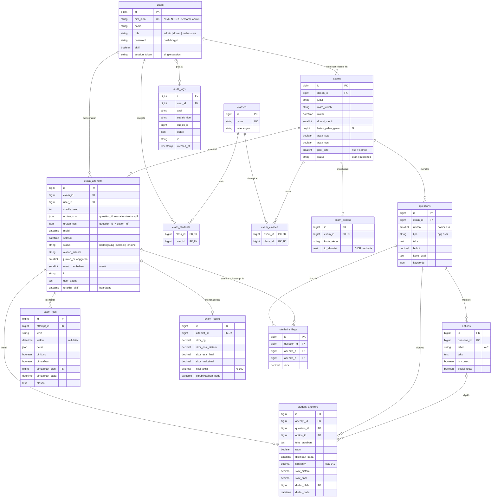

# ERD dan Skema Basis Data — ExamGuard CBT

Skema final hasil Task 1.1, diturunkan dari PRD §11. Sumber kebenaran adalah
berkas migration di `database/migrations/`. Tipe ditulis generik (berjalan di
SQLite, MySQL, dan PostgreSQL).

Tabel bawaan Laravel yang tetap dipakai: `sessions` (sesi berbasis basis data),
`cache`, `cache_locks`, `jobs`, `job_batches`, `failed_jobs` (antrean penilaian
esai massal).

## Penyesuaian terhadap PRD §11

| Tabel | Penyesuaian | Alasan |
|---|---|---|
| `users` | `aktif` | FR-01.3: admin dapat menonaktifkan akun tanpa menghapus data. |
| `users` | tanpa `email` dan tabel `password_reset_tokens` | Login memakai NIM/NIDN/username; reset password dilakukan admin. |
| `exam_classes` | tabel baru | FR-02.6: menetapkan ujian ke kelas. |
| `questions` | `urutan` | Nomor asli dari dosen, dasar sebelum diacak. |
| `exam_attempts` | `urutan_opsi` | PRD §9.2: pemetaan urutan acak opsi ke `option_id` asli disimpan di attempt. |
| `exam_attempts` | `jumlah_pelanggaran`, `alasan_selesai`, `terakhir_aktif` | Penghitung pelanggaran sisi server (PRD §9.1), alasan auto-submit, dan status offline di monitor. |
| `student_answers` | `ragu`, `similarity`, `skor_sistem`, `skor_final`, `dinilai_oleh`, `dinilai_pada` | Penanda ragu (FR-07.1) bertahan saat reload; skor per jawaban untuk koreksi esai side-by-side (FR-06.3). |
| `exam_logs` | `dihitung`, `dimaafkan_pada` | Membedakan insiden yang hanya dicatat (mis. perangkat berganti) dari pelanggaran; waktu pemaafan untuk audit. |
| `exam_results` | `skor_maksimal` | Penyebut nilai akhir skala 0–100. |
| `audit_logs` | tabel baru | Jejak "siapa, kapan, alasan" untuk sesi ganda (FR-01.2), pemaafan pelanggaran (FR-06.5), tambah waktu (FR-06.6), dan perubahan akun. |

## Aturan integritas

- Satu mahasiswa hanya punya satu attempt per ujian (`unique(exam_id, user_id)`).
- Satu jawaban per soal per attempt (`unique(attempt_id, question_id)`).
- Ujian yang sudah punya attempt tidak dapat dihapus (`restrictOnDelete`), sehingga
  jawaban dan log tidak hilang. Akun pengguna dinonaktifkan, bukan dihapus.
- Kunci jawaban (`options.is_correct`, `questions.kunci_esai`, `questions.keywords`)
  disembunyikan dari serialisasi model sebagai lapisan pertahanan tambahan; respons
  untuk mahasiswa juga dibangun eksplisit tanpa field tersebut.

## Rumus nilai

- PG: `skor_sistem = bobot` bila opsi benar, selain itu `0`; `skor_final = skor_sistem`.
- Esai: `skor_sistem = similarity × bobot` (rekomendasi); `skor_final` = keputusan dosen.
- `nilai_akhir = (skor_pg + skor_esai_final) / skor_maksimal × 100`, dibulatkan dua
  desimal, terisi setelah semua esai pada attempt dikonfirmasi dosen.
